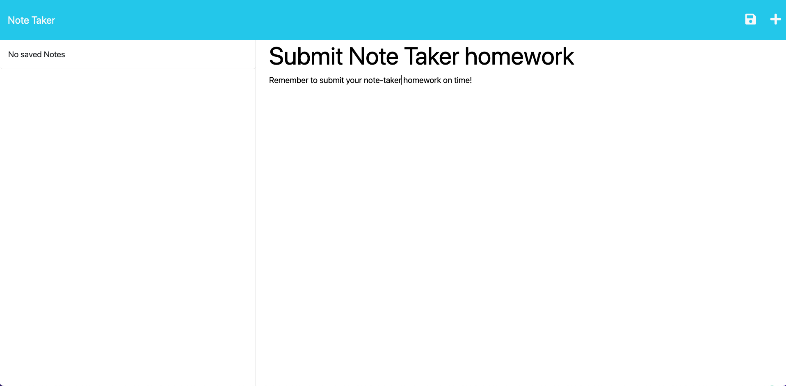
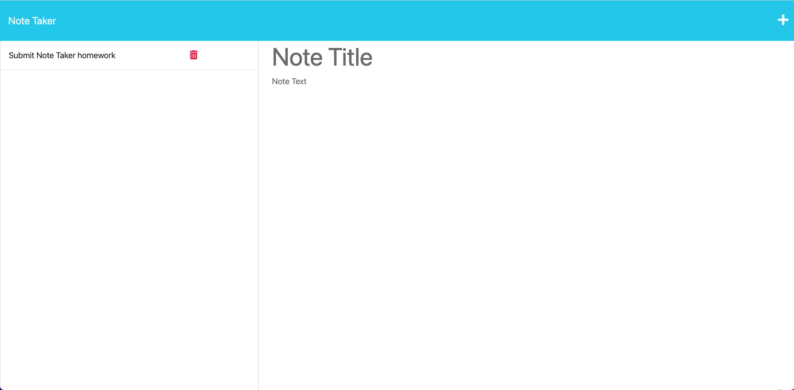
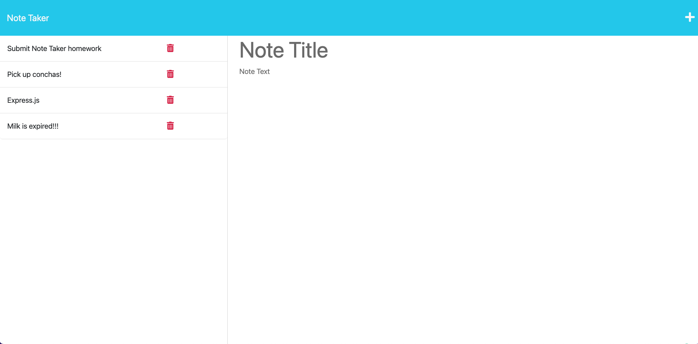
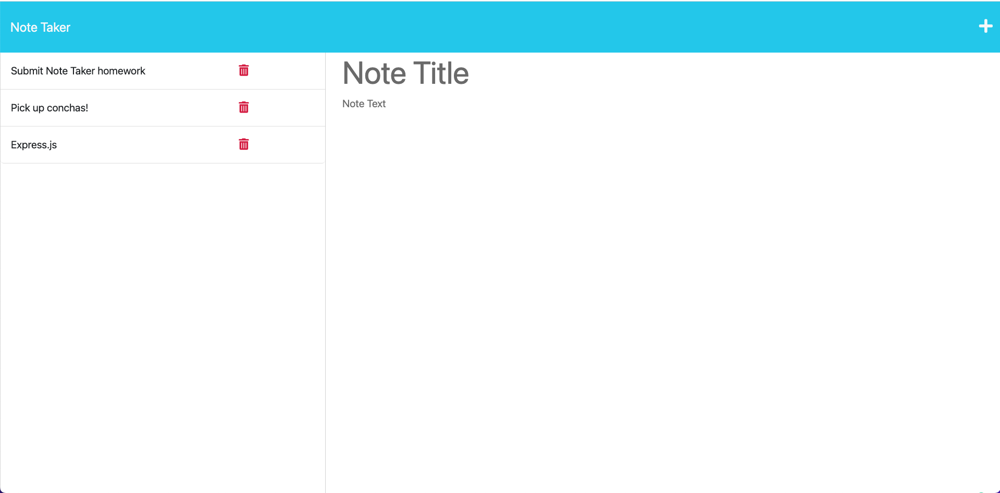
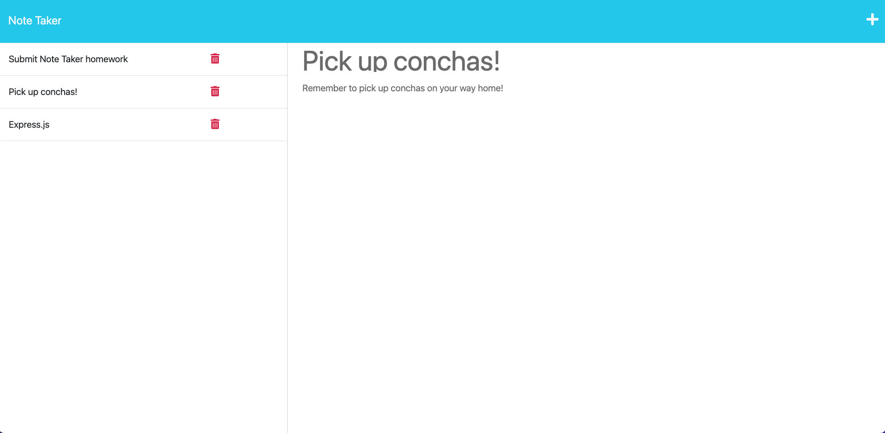
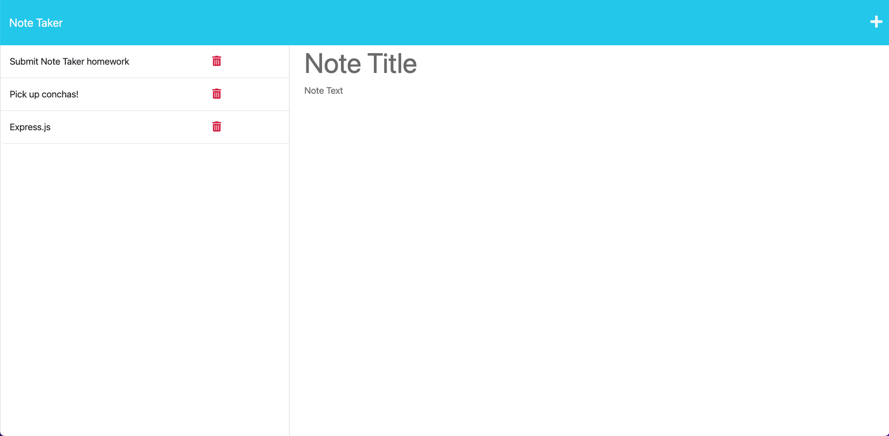

# 11 Express.js: Note Taker

## User Story

```
AS A boot camp student
I WANT any user to be able to write and save notes on my app
SO THAT they can organize their thoughts and keep track of tasks they need to complete
```

## Acceptance Criteria

```
GIVEN a note-taking application

WHEN I open the Note Taker
THEN I am presented with a landing page with a link to a notes page

WHEN I click on the link to the notes page
THEN I am presented with a page with existing/non-existing notes listed in the left-hand column, plus empty fields to enter a new note title and the note’s text in the right-hand column

WHEN I enter a new note title and the note’s text
THEN a Save icon appears in the navigation at the top of the page

WHEN I click on the Save icon
THEN the new note I have entered is saved and appears in the left-hand column with the other existing notes

WHEN I click on an existing note in the list in the left-hand column
THEN that note appears in the right-hand column

WHEN I'm looking at an existing note and click on the Plus icon in the navigation at the top of the page
THEN I am presented with empty fields to enter a new note title and the note’s text in the right-hand column

When I click on the red delete button on an exisiting note
Then that note will be deleted from the list of notes on the left-hand column
```

## Mock-Up

The following images show the web application's appearance and functionality:














## Links

Repository: https://github.com/edgarmartinez1212/Note-Taker

Heroku: https://note-taker-emartinez1212.herokuapp.com/
